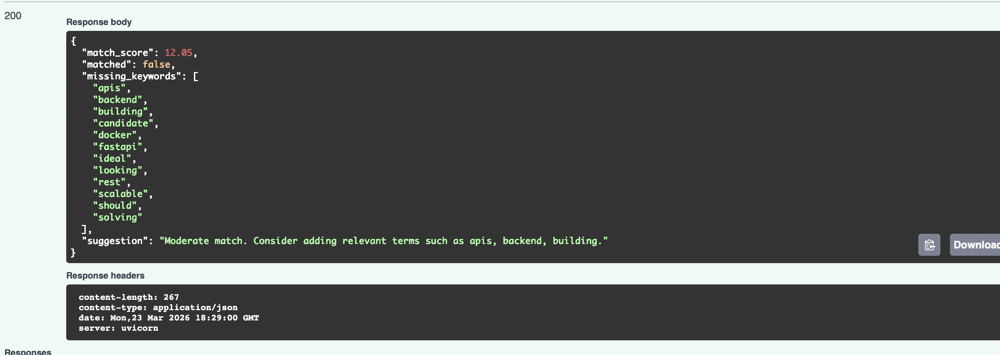

# HireSense AI - Resume Match Analyzer

HireSense AI is an NLP-powered API that compares resumes against job descriptions, calculates a match score, identifies missing keywords, and provides ATS-focused improvement suggestions.

## Features

- Upload resume in **PDF** or **TXT** format
- Compare resume with a target job description
- Generate a **match score**
- Detect **missing keywords**
- Return a smart improvement suggestion
- Interactive API docs with **FastAPI Swagger UI**

## Tech Stack

- Python
- FastAPI
- Scikit-learn
- PDFPlumber
- Uvicorn

## Project Structure

```bash
hiresense-ai/
├── app/
│   ├── main.py
│   └── utils.py
├── requirements.txt
└── README.md

## Then install packages:
pip install -r requirements.txt

## Then run:
uvicorn app.main:app --reload

## Then open:
http://127.0.0.1:8000/docs

## Sample Job Description

We are looking for a Python Developer with experience in FastAPI, REST APIs, Docker, SQL, machine learning, and cloud deployment. The ideal candidate should have strong problem-solving skills and experience building scalable backend systems.

## Example Response
{
  "match_score": 72.5,
  "matched": true,
  "missing_keywords": ["docker", "sql", "deployment"],
  "suggestion": "Good match. Adding a few missing keywords could improve ATS alignment."
}

## Future Improvements

Add DOCX resume support
Improve keyword extraction using NLP libraries
Add frontend with Streamlit or React
Deploy with Docker and cloud hosting
Add semantic matching with transformer embeddings

## API Preview



## Author
Dinkar Pai

